# Xv6-Labs 操作系统课程设计实验报告
2352626 马小云


> 课程：操作系统课程设计　|　选题：Xv6，MIT 6.S081 系列，RISC-V 版 xv6-labs-2021
> 完成度：10 个 Lab 全部完成，官方 `make grade` 全部满分
> 代码仓库：https://github.com/crimelody/24OS-xv6（`crimelody/24OS-xv6`），各 Lab 独立分支
> 报告对应分支：`util` `syscall` `pgtbl` `traps` `cow` `thread` `net` `lock` `fs` `mmap`

---

## 目录

- 一、实验概述
- 二、实验环境搭建
- 三、各实验详述
  - Lab 1 · Xv6 and Unix utilities
  - Lab 2 · System calls
  - Lab 3 · Page tables
  - Lab 4 · Traps
  - Lab 5 · Copy-on-Write Fork
  - Lab 6 · Multi-threading
  - Lab 7 · Networking
  - Lab 8 · Locks
  - Lab 9 · File system
  - Lab 10 · mmap
- 四、实验总结与心得

---

## 一、实验概述

本课程设计做的是 **MIT 6.S081，2021 年版**的 xv6 操作系统课程实验。xv6 是一个专门用来教学的小型类 Unix 操作系统，运行在 RISC-V 架构上。我按照 10 个递进式的 Lab 一步步给它加功能、改内核，内容覆盖进程与系统调用、虚拟内存与页表、陷阱与中断、进程调度与同步、设备驱动、锁竞争优化、文件系统、内存映射文件等主题。

每个 Lab 遵循统一的流程：在对应的 git 分支上写代码 → 运行官方测试程序 → 用 `make grade` 进行评分验收结果。动手前我会先阅读该 Lab 的官方实验说明，并对照 xv6 book 对应章节理解要实现的机制，再开始写代码。

### 主要收获

- 通过程序更清楚地认识到操作系统的几种抽象概念：进程、虚拟内存、文件、设备；
- 亲手走了一遍用户程序 → 系统调用 → 内核实现"的完整调用链；
- 实现了页表打印、陷阱、写时复制、多线程同步、网卡收发、锁优化、索引文件、mmap 等经典机制；
- 学到一套内核调试方法，包括 printf、gdb、addr2line 和 qemu monitor。

---

## 二、实验环境搭建

| 项目 | 方案 |
| --- | --- |
| 宿主机 | Windows 11，已启用 WSL2，开启虚拟化 |
| Linux 子系统 | Ubuntu 20.04.6 LTS，用户 mxy |
| 软件源 | 中科大镜像 `mirrors.ustc.edu.cn`
| 工具链 | `build-essential gdb-multiarch qemu-system-misc gcc-riscv64-linux-gnu binutils-riscv64-linux-gnu` |
| 实测版本 | qemu-system-riscv64 4.2.1 / riscv64-linux-gnu-gcc 9.4.0 / gdb-multiarch 9.2 / git 2.25.1 |
| 源码 | 官方 `git://g.csail.mit.edu/xv6-labs-2021`，含 11 个 Lab 分支 |
| 代码托管 | GitHub 私有仓库，每 Lab 独立分支管理 |

### 环境搭建步骤

1. 安装 WSL2 与 Ubuntu：`wsl --install -d Ubuntu-20.04`；
2. 配置中科大 apt 源后 `apt-get update && apt-get upgrade`；
3. 安装 RISC-V 交叉工具链与 QEMU；
4. 验证：`qemu-system-riscv64 --version`、`riscv64-linux-gnu-gcc --version`；
5. 获取源码：`git clone git://g.csail.mit.edu/xv6-labs-2021`，每 Lab 切到对应分支；
6. 首次启动验证：`make qemu` 出现 `init: starting sh` 与 `$`，即环境就绪，退出用 `Ctrl-a x`。

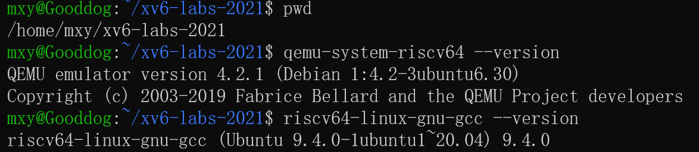

*图 2-1：WSL2 Ubuntu 中工具链安装验证*

### 实验工作流

```bash
git checkout <分支>      # 如 util / syscall / pgtbl ...
# 阅读官方实验说明与 xv6 book 对应章节
# 编写/修改代码（新增用户程序需注册进 Makefile 的 UPROGS）
make qemu                # 编译并在 qemu 中手动测试
make grade               # 官方自动评分
```

### 环境搭建遇到的问题

| 问题 | 解决 |
| --- | --- |
| 清华/阿里镜像对 Ubuntu 20.04 已停服，报 403/404 | 改用中科大镜像，实测可用 |
| GitHub 访问异常，属于实验室网络限制 | 改用官方 git 服务器 `g.csail.mit.edu` 的 9418 端口直连克隆源码，实测可用 |


---

## 三、各实验详述

### Lab 1 · Xv6 and Unix utilities

#### 实验目的
用 C 语言在 xv6 中实现 5 个用户程序：`sleep`，用于暂停指定 tick 数；`pingpong`，让父子进程通过两条管道来回传递一个字节；`primes`，用“每素数一进程 + 管道链”筛出 2~35 的素数；`find`，递归遍历目录、按文件名查找；`xargs`，读取标准输入的每一行，把该行追加到命令行参数后执行一次命令。借此熟悉 xv6 的编译、运行与调试流程，并体会进程、管道、文件描述符这几个概念在具体程序里是怎么配合工作的。写之前我先通读了官方 Lab: Xv6 and Unix utilities 的说明，并对照 xv6 book 第 1 章复习了系统调用接口，明确了每个程序要调用的系统调用。

#### 实验内容与步骤

**① sleep —— 暂停指定 ticks**
- 检查参数个数，无参时打印 usage 并退出；用 `atoi` 将字符串参数转整数；调用系统调用 `sleep()`；`main` 末尾 `exit(0)`。

**核心实现：`user/sleep.c`**

```c
int
main(int argc, char *argv[])
{
  // 检查参数个数：sleep 只接受一个 tick 数参数
  if(argc != 2){
    fprintf(2, "usage: sleep <ticks>\n");
    exit(1);
  }

  // 参数以字符串形式给出，先转成整数，再调用系统调用 sleep
  sleep(atoi(argv[1]));
  exit(0);
}
```

**② pingpong —— 双管道父子传字节**
- 用 `pipe` 建立两条单向管道，父→子一条、子→父一条；`fork` 后父进程写 1 字节、子进程读并打印 `<pid>: received ping` 后回写，父进程读回并打印 `<pid>: received pong`；
- 关键：fork 后父子共享全部管道文件描述符，必须**关闭各自不用的读写端**，否则 `read` 永不返回 0；父进程用 `wait()` 同步并回收子进程。

**③ primes —— 管道并发素数筛**
- 用"每素数一进程 + 管道链"实现并发筛法：首进程向管道写入 2~35，每个筛子进程读入一个素数打印，再把不可被该素数整除的数转发给下游；
- 关键：直接传 4 字节 `int`；**写端全部关闭后 `read` 返回 0** 作为链终止信号；进程用完即关闭不需要的 fd，避免 xv6 文件描述符/进程耗尽。

**核心实现：`user/primes.c`**

```c
// 思路：每个筛子进程读入一串整数，其中第一个数一定是素数，
// 先打印它，再把后续不能被它整除的数通过新管道传给下一个筛子进程。
void
sieve(int left[2])
{
  int prime, n;
  int right[2];   // 通向下一个筛子进程的管道

  close(left[1]); // left 只用于读，它的写端在调用方已经关闭

  // 先读一个数。若管道已关闭导致 read 返回 0，说明整条链结束，退出
  if(read(left[0], &prime, sizeof(int)) != sizeof(int)){
    close(left[0]);
    exit(0);
  }
  printf("prime %d\n", prime);

  if(pipe(right) < 0) exit(1);
  if(fork() == 0){
    // 子进程成为下一个筛子，只需要从 right 读数据
    close(right[1]); // 子进程不写 right，关闭写端
    close(left[0]);  // 左侧的数据已经处理完，不再需要
    sieve(right);
    exit(0);         // 递归返回后不再继续执行，这里兜底退出
  } else {
    // 本进程负责过滤：把不能被 prime 整除的数写入 right
    close(right[0]); // 本进程只写 right，关闭读端
    while(read(left[0], &n, sizeof(int)) == sizeof(int)){
      if(n % prime != 0)
        write(right[1], &n, sizeof(int));
    }
    close(left[0]);
    close(right[1]); // 写完关闭写端，下游 read 才会返回 0 而结束
    wait(0);
    exit(0);
  }
}
```

**④ find —— 递归目录查找**
- 参照 `user/ls.c`：`fmtname()` 取路径最后 `/` 后的名字；`find()` 依类型处理，`T_FILE` 时用 `strcmp` 比对文件名，C 不能用 `==` 比较字符串；`T_DIR` 时拼接子路径并**跳过 `.` 与 `..`** 递归进入。

**核心实现：`user/find.c`**

```c
  switch(st.type){
  case T_FILE:
    // 普通文件：若文件名匹配，打印完整路径
    if(strcmp(fmtname(path), name) == 0)
      printf("%s\n", path);
    break;

  case T_DIR:
    strcpy(buf, path);
    p = buf + strlen(buf);
    *p++ = '/';
    while(read(fd, &de, sizeof(de)) == sizeof(de)){
      if(de.inum == 0)          // 空目录项
        continue;
      // 不要递归进入 "." 和 ".."，否则会死循环
      if(strcmp(de.name, ".") == 0 || strcmp(de.name, "..") == 0)
        continue;
      memmove(p, de.name, DIRSIZ);
      p[DIRSIZ] = 0;            // 保证 buf 以 '\0' 结尾，供递归 open
      find(buf, name);          // 递归进入子目录
    }
    break;
  }
  close(fd);
}
```

**⑤ xargs —— 逐行读取并执行命令**
- 逐字符读取标准输入到 `\n`；把一行按空格/制表符切分成参数，用 `'\0'` 原地截断，指针数组存单词首；对每一行 `fork()` 后子进程 `exec()`，父进程 `wait()`；
- 参数数量检查用 `MAXARG`，定义在 `kernel/param.h`。

**核心实现：`user/xargs.c`**

```c
  // 逐字符读取标准输入，直到出现换行符
  while(read(0, &ch, 1) == 1){
    if(ch != '\n' && len < sizeof(buf) - 1){
      buf[len++] = ch;
      continue;
    }
    // 遇到 '\n'：处理完一整行
    buf[len] = '\0';
    len = 0;

    // 把 buf 按空格/制表符拆成参数，追加到 args[fixed..]
    int idx = fixed;
    char *p = buf;
    while(*p){
      while(*p == ' ' || *p == '\t')  // 跳过前导空白
        p++;
      if(*p == '\0')
        break;
      if(idx >= MAXARG - 1){          // 参数数量超限
        fprintf(2, "xargs: too many arguments\n");
        exit(1);
      }
      args[idx++] = p;                // 记下单词起点
      while(*p && *p != ' ' && *p != '\t')  // 走到单词末尾
        p++;
      if(*p)                          // 用 '\0' 切断，作为该参数的结尾
        *p++ = '\0';
    }

    // 该行确实拆出了参数才执行命令（空行跳过）
    if(idx > fixed){
      args[idx] = 0;
      if(fork() == 0){
        exec(args[0], args);
        fprintf(2, "xargs: exec %s failed\n", args[0]);
        exit(1);
      }
      wait(0);
    }
  }
```

#### 测试结果

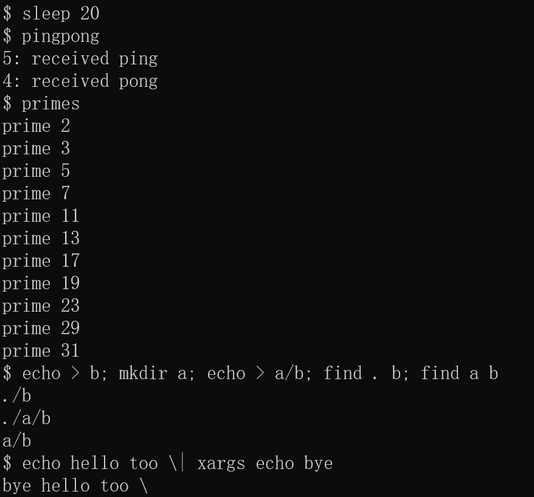

*图 3-1：Lab 1 五个 util 程序在 xv6 内运行结果，分别是 sleep、pingpong、primes、find、xargs*

图中依次展示了本实验实现的 5 个功能：`sleep 20` 让进程睡眠后正常退出；`pingpong` 通过两条管道让父子进程互相传一个字节，分别打印 received ping / received pong；`primes` 用“每素数一进程”的管道链筛出 2~35 的全部素数，验证了多级管道的数据转发与关闭写端后的 EOF 语义；`find . b`、`find a b` 递归遍历当前目录与子目录，按文件名找到 `b` 并输出完整路径；最后 `echo hello too | xargs echo bye` 把标准输入的一行“hello too”追加到固定参数后执行，输出 `bye hello too`，验证了 xargs 对标准输入行的拆分与二次 exec。

#### 实验中遇到的问题及解决

| 问题 | 解决 |
| --- | --- |
| 运行 `sh < xargstest.sh` 出现 `mkdir: a failed` | 是手工测试残留目录导致的，xv6 文件系统改动跨 qemu 运行会保留；`make clean && make qemu` 获得干净文件系统 |
| 初版 primes 父子职责混乱 | 明确"当前筛子读左→打印→过滤→写右；fork 出的子进程递归接管右管"，各分支严格关闭不需要的 fd |
| 忘注册用户程序 | 新建 `.c` 必须加入 `Makefile` 的 `UPROGS`，否则 `make qemu` 不编译 |

#### 实验心得
做完这 5 个小程序，我把“用户程序 → 系统调用 → 内核”这条链路走通了一遍：`user.h` 里是用户能调的函数，`usys.S` 负责真正发起系统调用，具体逻辑在 `kernel/sysproc.c` 里。对管道的单向性、读到 0 表示对端关闭、文件描述符的生命周期、`fork`/`wait` 这些以前只在书上见过的概念也有了亲身体会。还明白了 xv6 资源有限，用完的 fd 该关就得关。回看过程，官方说明里对每个程序应该调用哪些系统调用其实都给了提示，先读说明再动手能少走弯路。

---

### Lab 2 · System calls

#### 实验目的
搞清一个系统调用从用户程序到内核实现到底要经过哪些步骤，然后给 xv6 新增两个系统调用：`trace`，用来打印进程及其子进程都调用了哪些系统调用；`sysinfo`，用来返回当前空闲内存字节数和活动进程数。动手前，我按官方 Lab: system calls 的建议先读了 xv6 book 第 4 章和 `syscall.c` 等源码，弄清了系统调用号的传递过程。

#### 实验内容与步骤

**新增系统调用的通用五件套**，后面每个 Lab 都会反复用到：
1. `user/user.h`：函数原型；
2. `user/usys.pl`：`entry("xxx");`，用来生成 usys.S 汇编桩；
3. `kernel/syscall.h`：分配系统调用号；
4. `kernel/syscall.c`：`extern` 声明 + 注册进 `syscalls[]` 表；
5. 内核实现函数，必要时在 `defs.h` 声明。

**① trace 实现**
- `kernel/proc.h`：进程结构新增私有字段 `tracemask`；
- `kernel/sysproc.c`：`sys_trace()` 用 `argint` 读取掩码存入 `myproc()->tracemask`；
- `kernel/proc.c`：`fork()` 中将父进程 `tracemask` 复制给子进程，使跟踪覆盖全部后代；
- `kernel/syscall.c`：建立"编号→名字"表 `syscalls_name[]`；修改统一入口 `syscall()`——先执行系统调用，把返回值写回 `a0`，再用 `(mask >> num) & 1` 判定是否命中掩码，命中则打印 `pid: syscall 名字 -> 返回值`。

**核心实现：`kernel/syscall.c` 的 `syscall()`**

```c
void
syscall(void)
{
  int num;
  struct proc *p = myproc();

  num = p->trapframe->a7;
  if(num > 0 && num < NELEM(syscalls) && syscalls[num]) {
    // 先调用，再取返回值 a0
    p->trapframe->a0 = syscalls[num]();
    // 若本进程设置了 trace 掩码，且该位命中，则打印跟踪信息
    if(p->tracemask && (p->tracemask >> num) & 1) {
      printf("%d: syscall %s -> %d\n",
             p->pid, syscalls_name[num], p->trapframe->a0);
    }
  } else {
    printf("%d %s: unknown sys call %d\n", p->pid, p->name, num);
    p->trapframe->a0 = -1;
  }
}
```

**核心实现：`kernel/sysproc.c` 的 `sys_trace()`**

```c
uint64
sys_trace(void)
{
  int mask;
  if(argint(0, &mask) < 0)     // 从 trapframe->a0 取参数
    return -1;
  myproc()->tracemask = mask;  // 存进当前进程
  return 0;
}
```

**② sysinfo 实现**
- `kernel/kalloc.c` 新增 `getfreemem()`：遍历 `kmem.freelist` 空闲链表计数 × `PGSIZE`，须加 `kmem.lock`；
- `kernel/proc.c` 新增 `getnproc()`：统计 `proc[]` 数组中状态非 `UNUSED` 的进程数；
- `sys_sysinfo()`：取用户传入的结构体指针后，`copyout()` 把 `struct sysinfo` 拷回用户空间。

**核心实现：`kernel/sysproc.c` 的 `sys_sysinfo()`**

```c
uint64
sys_sysinfo(void)
{
  uint64 addr;                 // 用户空间 struct sysinfo* 的地址
  struct sysinfo info;
  struct proc *p = myproc();

  if(argaddr(0, &addr) < 0)
    return -1;

  info.freemem = getfreemem();
  info.nproc = getnproc();

  // 把内核栈上的 info 拷贝到用户空间的 addr 处
  if(copyout(p->pagetable, addr, (char *)&info, sizeof(info)) < 0)
    return -1;
  return 0;
}
```

#### 测试结果

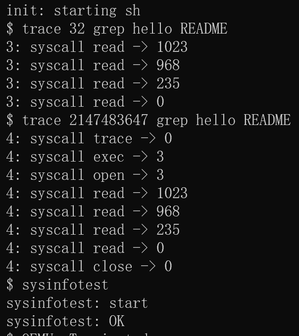

*图 3-2：Lab 2 trace 跟踪系统调用与 sysinfotest 运行结果*

图中上半部分是 `trace` 的效果：对 `grep hello README` 设置掩码后，可以看到进程打印出了自己调用过的每个系统调用及其返回值，说明 trace 在 `syscall()` 统一入口处拦截并按掩码命中打印的实现生效；下半部分 `sysinfotest` 通过 `sysinfo` 查询空闲内存与活动进程数，并在多次 fork、sleep、exit 后校验数值一致性，验证了 `getfreemem()` 统计空闲链表、`getnproc()` 统计非 UNUSED 进程以及 `copyout` 把结构体写回用户空间这三部分实现都正确。

#### 实验中遇到的问题及解决

| 问题 | 解决 |
| --- | --- |
| `argint` 与 `argaddr` 混淆 | `trace` 参数是 32 位整数用 `argint`；`sysinfo` 参数是 64 位指针用 `argaddr`；二者本质都读 trapframe 的 `a0` |
| 忘记内核→用户的数据回传需 `copyout` | xv6 用户/内核地址空间隔离，不能直接 `*user_ptr = info`；参照 `sys_fstat`→`filestat` 用 `copyout` 按页表拷贝 |
| 新函数未在 `defs.h` 声明导致编译错 | xv6 无自动头文件依赖，跨文件调用须在 `defs.h` 集中声明，并 `#include "sysinfo.h"` |
| 用户测试程序未进文件系统 | `Makefile` 的 UPROGS 按 `LAB=syscall` 条件注册 `_trace`、`_sysinfotest` |

#### 实验心得
通过这个 Lab 理解了“系统调用号约定”：`a7` 寄存器放系统调用编号，`syscall()` 按编号查表调用对应函数，参数和返回值都通过 trapframe 里的寄存器传递。还学到两个经验：一是进程私有的字段，比如 `tracemask`，只有本进程能碰，不需要加锁；二是内核和用户是两块隔离的地址空间，往用户空间写数据必须用 `copyout`，不能直接解引用用户指针。如果先按官方建议读通 book 第 4 章里的系统调用路径，再动手新增调用，会理解得更顺。

---

### Lab 3 · Page tables

#### 实验目的
熟悉 RISC-V 三级页表的结构和用法，完成三件事：① 让内核和用户共享一个只读页，把频繁的 `getpid` 加速成不陷入内核的调用；② 写一个 `vmprint()`，把进程页表逐层打印出来；③ 新增 `pgaccess` 系统调用，通过页表里的访问位 A 位告诉用户哪些页被访问过。动手前，我对照官方 Lab: page tables 的提示与 xv6 book 第 3 章，复习了三级页表的结构和各 PTE 标志位的含义。

#### 实验内容与步骤

**① Speed up system calls，即 ugetpid**
- `proc.h`：`struct proc` 新增 `usyscallpage` 指针；补 `struct usyscall;` 前向声明；
- `proc.c` `allocproc()`：`kalloc` 一页并写入本进程 pid；`proc_pagetable()` 中用 `mappages(..., USYSCALL, PGSIZE, ..., PTE_R|PTE_U)` 建立**只读**映射，不能加 `PTE_W`；`freeproc()`/`proc_freepagetable()` 中分别释放物理页与取消映射；
- 用户态 `ugetpid()` 是官方提供的，直接读 `USYSCALL` 处共享页返回 pid，全程不陷入内核。

**核心实现：`kernel/proc.c` 的 `proc_pagetable()`**

```c
  // lab 3: 把 usyscall 页映射到用户地址 USYSCALL。
  // 用户只能读（PTE_R|PTE_U），不能写（无 PTE_W）——pid 由内核维护。
  if(mappages(pagetable, USYSCALL, PGSIZE,
              (uint64)(p->usyscallpage), PTE_R | PTE_U) < 0){
    uvmunmap(pagetable, TRAMPOLINE, 1, 0);
    uvmunmap(pagetable, TRAPFRAME, 1, 0);
    uvmfree(pagetable, 0);
    return 0;
  }
  return pagetable;
```

**② Print a page table，即 vmprint**
- `defs.h` 声明 `vmprint`；`vm.c` 实现递归打印，参考 `freewalk` 的遍历方式：对每个有效 PTE 打印 `层级缩进 + 索引 + pte + pa`，PTE 无 R/W/X 位即指向下级页表则继续递归；
- `exec.c`：`if(p->pid == 1) vmprint(p->pagetable);` 在 init 进程 exec 时打印。
- 格式要点：缩进数 = 层级 + 1，根条目也打一个 `.. `，需与官方样例逐字符一致。

**核心实现：`kernel/vm.c`**

```c
static void
vmprint_rec(pagetable_t pagetable, int depth)
{
  for(int i = 0; i < 512; i++){
    pte_t pte = pagetable[i];
    if(pte & PTE_V){
      uint64 pa = PTE2PA(pte);
      for(int j = 0; j < depth + 1; j++)
        printf(".. ");
      printf("%d: pte %p pa %p\n", i, pte, pa);
      // 若该 PTE 指向下一级页表（无 R/W/X 标志位），继续递归
      if((pte & (PTE_R|PTE_W|PTE_X)) == 0)
        vmprint_rec((pagetable_t)pa, depth + 1);
    }
  }
}

void
vmprint(pagetable_t pagetable)
{
  printf("page table %p\n", pagetable);
  vmprint_rec(pagetable, 0);
}
```

**③ pgaccess**
- `riscv.h`：定义 `PTE_A (1L << 6)`，RISC-V 硬件访问页时自动置位；
- 改写官方在 `sysproc.c` 预置的空壳 `sys_pgaccess`：用 `walk()` 逐个检查 `base` 起的 `len` 个页的 `PTE_A`，置入 `maskbits` 后**清除 A 位**，供下次检测，最后 `copyout` 返回位图。

**核心实现：`kernel/sysproc.c` 的 `sys_pgaccess()`**

```c
uint64
sys_pgaccess(void)
{
  uint64 base;        // 起始虚拟地址
  int len;            // 页数
  uint64 maskaddr;    // 用户态位图缓冲区地址
  struct proc *p = myproc();
  uint64 maskbits = 0;
  pte_t *pte;

  argaddr(0, &base);
  argint(1, &len);
  argaddr(2, &maskaddr);
  if(len > 64 || len < 0)
    return -1;

  for(int i = 0; i < len; i++){
    if((pte = walk(p->pagetable, base + i * PGSIZE, 0)) == 0)
      return -1;
    if(*pte & PTE_A){
      maskbits |= (1L << i);  // 第 i 页被访问过 → 第 i 位置 1
      *pte &= ~PTE_A;         // 清除 A 位，供下一次检测
    }
  }
  if(copyout(p->pagetable, maskaddr, (char *)&maskbits, sizeof(maskbits)) < 0)
    return -1;
  return 0;
}
```

#### 测试结果

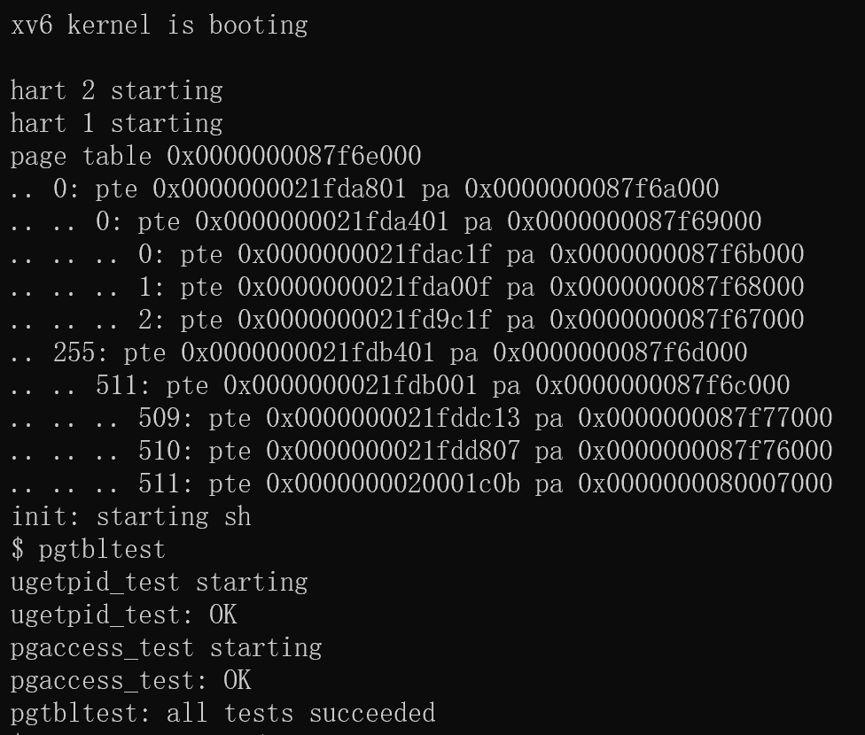

*图 3-3：Lab 3 启动时 vmprint 打印 init 页表与 pgtbltest 运行结果*

图中启动横幅部分展示了 `vmprint` 的输出：内核在 init 进程被 exec 时打印其页表，从根页表开始逐层列出每个有效 PTE 的编号、权限与物理地址，并用缩进区分三级层次，说明递归遍历与缩进格式符合官方样例。随后 `pgtbltest` 依次通过三个测试：`ugetpid_test` 验证用户程序可以直接读共享只读页拿到 pid，全程不再发起系统调用；`pgaccess_test` 先访问部分页面再调用 `pgaccess`，从返回的位图能看出被访问的页对应位置 1，验证了用页表 A 位统计访问情况的实现。

#### 实验中遇到的问题及解决

| 问题 | 解决 |
| --- | --- |
| 与官方空壳重复定义 `sys_pgaccess` | pgtbl 分支 `sysproc.c` 已在 `#ifdef LAB_PGTBL` 内预置空壳；改写而非另加 |
| `walk` 未声明 | xv6 中 `walk` 定义于 vm.c 却未列入 defs.h，在 sysproc.c 顶部自行 `extern` |
| vmprint 缩进少一层，grade 的 pte printout 报 FAIL | 官方期望根页表项也带 `.. ` 前缀，缩进 = 层级 + 1，修正后格式一致 |
| 共享页权限误加 PTE_W | ugetpid 页必须只读，用 `PTE_R|PTE_U`，否则用户可篡改 pid |
| 页表释放漏 unmap 致 `panic: freewalk: leaf` | `proc_freepagetable` 需 `uvmunmap(USYSCALL)` |

#### 实验心得
打印页表之后，我更清晰地理解了三级页表结构，虚拟地址的高 27 位被拆成三段各 9 位索引，一层一层往下查到最后的物理页。getpid 这个例子也让我体会到虚拟内存还能用来提速：getpid 调用频繁，但内容只是 4 字节只读数据，干脆把页放到一个用户和内核共享的只读页里，用户直接读就不用进内核了，Linux 的 vDSO 也是类似思路。还学会了 A 位由硬件自动置位、软件读取后要清掉，判断哪些页在用就可以用这个。对照 book 第 3 章的内容来看这些页表代码，理解会顺畅不少，这也让我养成了先读文档再写代码的习惯。

---

### Lab 4 · Traps

#### 实验目的
研究“陷阱”是怎么产生、怎么被处理的。trap 是计算机中中断与异常的总称。① 先通过一组 RISC-V 汇编阅读题热身；② 实现 `backtrace()`，能打印出当前的函数调用栈；③ 实现 `sigalarm`/`sigreturn`，让进程每运行满固定时钟周期就自动调用一次用户函数，体验用户级陷阱处理。动手前，我先阅读了官方 Lab: traps 的说明，并结合 xv6 book 第 4 章复习了 trap 流程与寄存器约定。

#### 实验内容与步骤

**① RISC-V assembly，热身问答**
阅读编译生成的 `user/call.asm` 回答六个问题，要点：
- 参数经寄存器 a0~a7 传递，比如 `main` 中 13 在 `a2`；
- 编译器内联优化使 `f(8)+1` 折叠为常量 12，main 中不存在对 f/g 的调用；
- `printf` 地址 0x640；`jalr` 之后 `ra = pc+4 = 0x38`；
- 大小端：`0x00646c72` 小端存储读得 "rld"，大端需 `0x00726c64`；
- 变参缺参时 `printf` 仍从寄存器取值，输出垃圾值。

**② Backtrace**
- `riscv.h` 新增内联汇编 `r_fp()` 读取帧指针 `s0`；
- `printf.c` 实现 `backtrace()`：从 `r_fp()` 出发，每帧返回地址在 `fp-8`、上一帧指针在 `fp-16`；用 `PGROUNDDOWN(fp)` 判断是否走出本内核栈页作为终止条件；
- `sys_sleep` 中调用，配合 `bttest` 验证，三行地址可用 `addr2line` 还原。

**核心实现：`kernel/printf.c` 的 `backtrace()`**

```c
void
backtrace(void)
{
  uint64 fp = r_fp();   // 当前帧指针
  uint64 top = PGROUNDDOWN(fp);  // 本内核栈所在页的底部

  printf("backtrace:\n");
  while(fp >= top && fp < top + PGSIZE){
    uint64 ra = *(uint64 *)(fp - 8);   // 保存的返回地址
    printf("%p\n", ra);
    fp = *(uint64 *)(fp - 16);         // 上一帧的帧指针
    if(fp < top || fp >= top + PGSIZE) // 越界则停
      break;
  }
}
```

**③ Alarm，即 sigalarm/sigreturn**
- 系统调用五件套，编号 22/23；`proc.h` 加进程私有字段：`alarm_interval`、`handler_va`、`passed_ticks`、`alarm_reentrant`、`saved_trapframe`，在 `allocproc` 初始化；
- `sys_sigalarm()`：保存间隔与处理函数地址，清零计时与重入标志；
- 修改 `usertrap()` 的时钟中断分支，即 `which_dev==2`：累计 `passed_ticks`，到间隔且非重入时，① 整块保存 `saved_trapframe = *trapframe`；② 改 `epc = handler_va` 使 `sret` 跳去用户处理函数；③ 清零计时；④ 置 `alarm_reentrant` 防重入；
- `sys_sigreturn()`：`*trapframe = saved_trapframe` 恢复现场，解除重入标志。

**核心实现：`kernel/trap.c` 的 `usertrap()`**

```c
  if(which_dev == 2){
    struct proc *ap = myproc();
    if(ap->alarm_interval > 0 && !ap->alarm_reentrant){
      ap->passed_ticks++;
      if(ap->passed_ticks >= ap->alarm_interval){
        ap->saved_trapframe = *ap->trapframe;  // ① 保存现场
        ap->trapframe->epc = ap->handler_va;   // ② 下次进用户态从 handler 跑
        ap->passed_ticks = 0;                  // ③ 重新计时
        ap->alarm_reentrant = 1;               // ④ 防重入
      }
    }
    // give up the CPU if this is a timer interrupt.
    yield();
  }
```

**核心实现：`kernel/sysproc.c` 的 `sys_sigalarm`/`sys_sigreturn`**

```c
uint64
sys_sigalarm(void)
{
  int interval;
  uint64 handler;
  struct proc *p = myproc();

  if(argint(0, &interval) < 0) return -1;
  if(argaddr(1, &handler) < 0) return -1;

  p->alarm_interval = interval;
  p->handler_va = handler;
  p->passed_ticks = 0;         // 重置计时
  p->alarm_reentrant = 0;      // 允许新一轮触发
  return 0;
}

uint64
sys_sigreturn(void)
{
  struct proc *p = myproc();

  *p->trapframe = p->saved_trapframe;  // 恢复保存的全部寄存器/PC
  p->alarm_reentrant = 0;              // 处理函数结束，允许下次触发
  return p->trapframe->a0;             // 返回值在 a0，保持调用语义
}
```

#### 测试结果

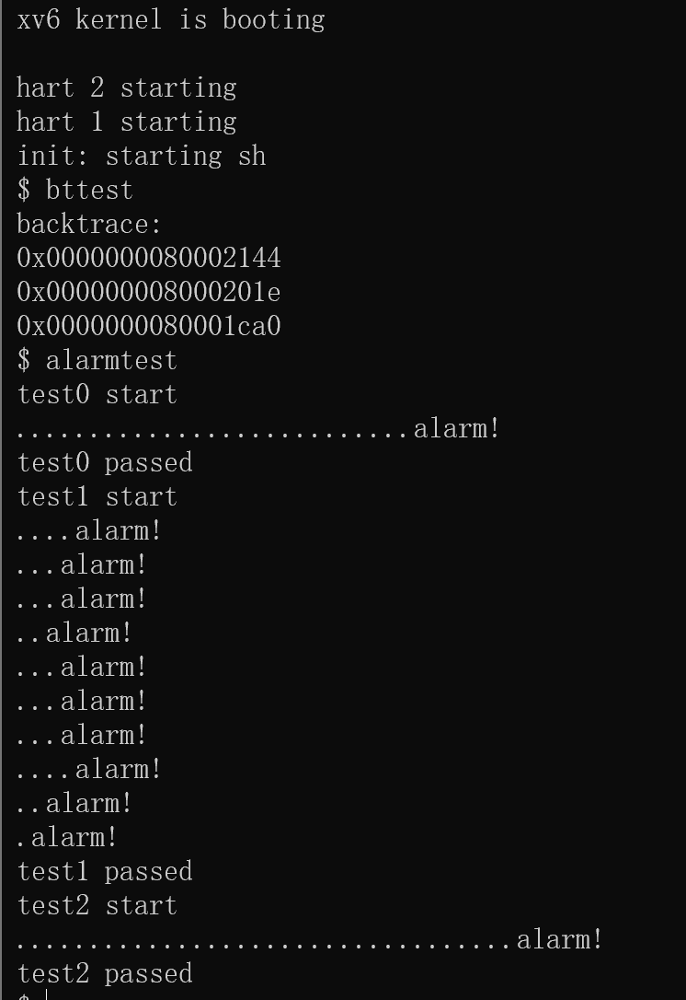

*图 3-4：Lab 4 bttest 调用栈回溯与 alarmtest 运行结果*

图中 `bttest` 输出一个 `backtrace:` 和随后的几行返回地址：每行是一个栈帧中保存的返回地址，从最内层到外层逐帧展开，说明 backtrace 按“返回地址在 fp-8、上一帧指针在 fp-16”的布局沿调用栈回溯成功。接着 `alarmtest` 的三组用例全部通过：test0 验证每满固定 tick 周期会周期性地进入用户处理函数；test1 验证在多次进入处理函数后，中断现场能被完整保存和恢复，用户程序的变量状态不丢；test2 验证处理函数执行期间发生重入时会被正确拦截，说明 sigalarm/sigreturn 的计时、改 epc 跳转、trapframe 整块恢复与防重入逻辑都生效。

#### 实验中遇到的问题及解决

| 问题 | 解决 |
| --- | --- |
| usertrap 中误加提前 return | 会跳过 `usertrapret()` 致进程无法回用户态；alarm 逻辑须嵌入原有 `if(which_dev==2){...yield();}` 控制流 |
| 现场恢复不完整致 test1 的 `i != j` | 必须整块 `*p->trapframe = p->saved_trapframe`，不能只恢复部分寄存器 |

#### 实验心得
陷阱是用户态和内核态之间唯一的通路：ecall/中断进来 → 走 trampoline → 进 `usertrap()` 处理 → `usertrapret()` → sret 回到用户态。alarm 的做法是，到时间后把 `epc` 改成用户函数的地址，返回用户态时就会先执行这个函数；处理完再用保存好的整个 trapframe 把现场恢复回去。这套机制让我真正理解了用户级陷阱处理。另外，RISC-V 的寄存器约定也让我印象深刻，a0~a7 负责传参，ra 存返回地址，s0 是帧指针，这是看懂汇编和写 backtrace 的基础。官方 hints 里提示的寄存器布局和返回地址位置，与 book 第 4 章完全对应，照文档实现确实省事。

---

### Lab 5 · Copy-on-Write Fork

#### 实验目的
给 `fork()` 加上“写时复制”。`fork()` 时不再把父进程的所有物理内存都复制一份，而是让父子进程共享页面，同时把这些页表项标成只读 + COW；谁先写这个页，谁就触发一次缺页，由内核现场复制出真正属于自己的页。最麻烦的是要维护物理页的引用计数：一个页可能同时被好几个进程引用，要等最后一个引用释放了才能回收。动手前，我按官方 Lab: Copy-on-Write Fork 的建议，结合 xv6 book 第 3、4 章复习了页表权限位和缺页处理流程。

#### 实验内容与步骤

**① 基础设施：PTE 标记与引用计数，主要在 kalloc.c**
- `riscv.h`：`PTE_COW = PTE_RSW = (1L << 8)`，这是 RISC-V 保留给软件使用的位；
- 全局 `refcnt[PHYSTOP/PGSIZE]` + 独立锁；`kalloc()` 置 1；`kfree()` 减 1，**大于 0 则不回收**；`freerange()` 初始化时每页先置 1 再 kfree，减到 0 才入空闲链表；
- 新增 `incref()` 和 `pageref()` 两个辅助函数，前者增引用、后者查引用数。

**核心实现：`kernel/kalloc.c`**

```c
int refcnt[PHYSTOP / PGSIZE];
struct spinlock refcnt_lock;

int
pageref(void *pa)
{
  int n;
  acquire(&refcnt_lock);
  n = refcnt[(uint64)pa / PGSIZE];
  release(&refcnt_lock);
  return n;
}

void
incref(void *pa)
{
  acquire(&refcnt_lock);
  refcnt[(uint64)pa / PGSIZE]++;
  release(&refcnt_lock);
}
```

```c
  // lab 5: 引用计数减一，仅当无任何引用时才真正回收
  acquire(&refcnt_lock);
  if(refcnt[(uint64)pa / PGSIZE] < 1)
    panic("kfree: refcnt underflow");
  refcnt[(uint64)pa / PGSIZE]--;
  int still_refd = refcnt[(uint64)pa / PGSIZE];
  release(&refcnt_lock);
  if(still_refd > 0)
    return;             // 还有其他进程引用，暂不释放
```

**② uvmcopy：共享页而非复制，主要在 vm.c**
- 遍历父进程用户页：**仅当原页可写**，即带 `PTE_W` 时才做 COW——清 `PTE_W`、置 `PTE_COW`，且**父进程页表同步修改**；随后把该页映射进子进程并 `incref`。
- 只读页，比如代码段，不标 COW，保持共享只读，写它仍按原语义报错。

**核心实现：`kernel/vm.c` 的 `uvmcopy()`**

```c
    pa = PTE2PA(*pte);
    flags = PTE_FLAGS(*pte);

    // 只对"原本可写"的页做 COW：只读页（如代码段）保持共享只读即可，
    // 若误标 COW，会破坏只读保护（写它本应 fault 而不是复制）。
    if(flags & PTE_W){
      flags = (flags & ~PTE_W) | PTE_COW;   // 清写位，标 COW
      *pte = (PA2PTE(pa) | flags);          // 父进程页表同步清写位
    }

    if(mappages(new, i, PGSIZE, pa, flags) != 0){
      uvmunmap(new, 0, i / PGSIZE, 1);
      return -1;
    }
    incref((void *)pa);   // 子进程共享了该页，引用 +1
```

**③ cowhandler 缺页处理**
- `vm.c` 新增 `cowhandler(pagetable, va)`：校验 PTE 存在且满足 V+COW+U+非W → `kalloc` 新页、复制旧页内容、更新本进程 PTE，去 COW、加 W；再 `kfree` 旧页，其他进程仍引用则不会真释放。

**核心实现：`kernel/vm.c` 的 `cowhandler()`**

```c
  flags = PTE_FLAGS(*pte);
  // 必须是 COW 页才处理：有效 + 标了 COW + 用户页 + 当前不可写
  if((flags & PTE_V) == 0 || (flags & PTE_COW) == 0 ||
     (flags & PTE_U) == 0 || (flags & PTE_W) != 0)
    return -1;

  pa = PTE2PA(*pte);
  if((newpa = (uint64)kalloc()) == 0)
    return -1;                 // 无内存，kill 该进程
  memmove((void *)newpa, (void *)pa, PGSIZE);   // 复制旧页内容
  flags = (flags & ~PTE_COW) | PTE_W;           // 去掉 COW，改为可写
  *pte = (PA2PTE(newpa) | flags);               // 本进程 PTE 指向新页

  kfree((void *)pa);   // 旧页引用 -1（若其他进程仍引用则不会真释放）
  return 0;
```

**④ usertrap 接入，主要在 trap.c**
- `r_scause()==15`，即 store/AMO page fault 时，用 `r_stval()` 取故障地址并调 `cowhandler`；失败时说明是真只读页被写或内存不足，kill 进程。

**核心实现：`kernel/trap.c` 的 `usertrap()`**

```c
  } else if(r_scause() == 15){
    // lab 5: store page fault——尝试写 COW 页，触发写时复制
    uint64 fault_va = r_stval();       // 引发故障的虚拟地址
    if(cowhandler(p->pagetable, fault_va) < 0)
      p->killed = 1;                   // 非 COW 写或内存不足 → 杀进程
  }
```

**⑤ copyout 处理 COW，主要在 vm.c**
- 内核向用户空间写，比如 `write()`，遇到 COW 页时也先 `cowhandler` 复制。注意目标地址须满足 `va < MAXVA` 再 `walk`，防止伪造地址触发 panic。

#### 测试结果

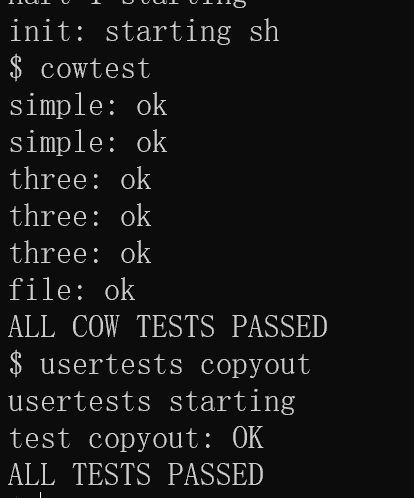

*图 3-5：Lab 5 cowtest 与 usertests copyout 运行结果*

图中 `cowtest` 依次通过多组用例：`simple` 系列先 fork 出大量子进程并各自写父进程内存，验证了写时复制只在写的一瞬间分配新页，且父子进程互不干扰；`three` 系列验证一个物理页同时被三个进程引用时，只有最后一个进程释放后页面才真正回收，引用计数正确；`file` 用例验证父子进程对同一文件映射页的 COW 行为。后面的 `usertests copyout` 单独回归 copyout：它构造一个非法用户地址让内核执行 `copyout`，验证了内核向用户空间写数据遇到 COW 页时也会先复制、且对越界地址不会 panic，说明用户写与内核写两条 COW 路径都已处理。

#### 实验中遇到的问题及解决

| 问题 | 解决 |
| --- | --- |
| copyout 对超 MAXVA 伪造地址调用 walk 触发 panic，usertests 的 copyout 测试 FAIL，首评 81/110 | `if (va0 < MAXVA)` 保护后再 walk，超界交 `walkaddr` 返回 -1，保持原语义；修复后 110/110 |
| `freerange` 初始化时 refcnt 为 0 导致 `kfree` underflow panic | 初始化先置每页引用为 1，首次 kfree 减到 0 才入空闲链表 |
| 只读页被误标 COW | 破坏只读保护语义，写只读页应报错而不是复制；必须用 `if (flags & PTE_W)` 才做 COW |

#### 实验心得
这个实验让我对“共享物理页”有了实感：COW 的核心就是页表项和物理页不是一一对应的，所以必须维护好每个物理页被引用了几次。kalloc 出来计数为 1，别人共享就 `incref`，释放时 `kfree` 自减，减到 0 才真正回收。而写时复制本质上也是一种“缺页时再补做”的思路，跟后面的 lazy allocation 是一个套路。另外要注意：用户程序自己写会触发 page fault，但内核用 `copyout` 帮用户写时同样可能碰到 COW 页，两条路径都要处理，漏一处就会破坏隔离。hints 特意提醒区分只读页和 COW 页，结合 book 第 3 章权限位的说明，写代码前方向就基本确定了。

---

### Lab 6 · Multi-threading

#### 实验目的
做三件和多线程有关的事：① 不依赖内核，在用户态自己实现线程的创建与切换，即 uthread；② 找出多线程哈希表并发插入时“丢键”的原因，并用 pthread 锁修好，同时尽量提高并发度；③ 用条件变量实现一个“等到齐了才放行”的屏障，即 barrier。动手前，我先读了官方 Lab: Multithreading 的说明，并对照 xv6 book 第 6、7 章学习锁与上下文切换的知识。

#### 实验内容与步骤

**① Uthread：用户级线程切换，在 xv6 内运行**
- `struct thread` 增加 `struct context`，包括 ra/sp/s0~s11 共 14 个 callee-saved 寄存器，与内核 `struct context` 一致；
- `thread_create()`：初始化 context，`ra = 函数地址`、`sp = 栈顶`，因为栈向低地址生长；
- `uthread_switch.S`：对照内核 `swtch.S`，保存 old context 到 `a0`、恢复 new context 自 `a1`，`ret` 跳转到新线程上次离开处，新建线程则跳函数入口；
- `thread_schedule()` 调 `thread_switch((uint64)&t->context, (uint64)&next->context)`。

**核心实现：`user/uthread.c`**

```c
struct thread {
  char       stack[STACK_SIZE]; /* the thread's stack */
  int        state;             /* FREE, RUNNING, RUNNABLE */
  struct context context;       /* lab 6: 线程切换时保存/恢复的寄存器 */
};

void
thread_create(void (*func)())
{
  struct thread *t;
  for (t = all_thread; t < all_thread + MAX_THREAD; t++) {
    if (t->state == FREE) break;
  }
  t->state = RUNNABLE;
  // lab 6: 初始化新线程的上下文——
  //   ra = func：第一次被 thread_switch 切到时 ret 会跳到 func
  //   sp = 栈顶：该线程用自己的栈执行（向低地址生长，sp 从高地址开始）
  memset(&t->context, 0, sizeof(t->context));
  t->context.ra = (uint64)func;
  t->context.sp = (uint64)(t->stack + STACK_SIZE);
}
```

**核心实现：`user/uthread_switch.S`**

```asm
thread_switch:
	/* 保存当前线程（old）的 callee-saved 寄存器到 a0 指向的 context */
	sd ra, 0(a0)
	sd sp, 8(a0)
	sd s0, 16(a0)
	sd s1, 24(a0)
	...
	sd s11, 104(a0)

	/* 从 a1 指向的 context 恢复新线程（next）的寄存器 */
	ld ra, 0(a1)
	ld sp, 8(a1)
	ld s0, 16(a1)
	...
	ld s11, 104(a1)

	ret    /* 跳到新线程 context->ra：若是新建线程则是其函数入口 */
```

**② Using threads，即 ph**
- 分析：单线程正常；多线程并发 `put` 同一桶时，"读链表头→insert→写表头"非原子，后者覆盖前者导致丢键；
- 修复：**每桶一把锁**，即 `pthread_mutex_t lock[NBUCKET]`，`put` 只锁 `key % NBUCKET` 对应桶的临界区，这样同时满足 `ph_safe`，即不丢键，和 `ph_fast`，即不同桶可以并发不互斥。

**核心实现：`notxv6/ph.c` 的 `put()`**

```c
pthread_mutex_t lock[NBUCKET];   // lab 6: 每个哈希桶一把锁（细粒度并发）

static
void put(int key, int value)
{
  int i = key % NBUCKET;

  // lab 6: 该桶的链表是共享结构，多线程 put 同一桶会竞争。
  // 用 per-bucket 锁保护"查表 + 插入/更新"整个临界区。
  pthread_mutex_lock(&lock[i]);

  // is the key already present?
  struct entry *e = 0;
  for (e = table[i]; e != 0; e = e->next) {
    if (e->key == key)
      break;
  }
  if(e){
    // update the existing key.
    e->value = value;
  } else {
    // the new is new.
    insert(key, value, &table[i], table[i]);
  }

  pthread_mutex_unlock(&lock[i]);
}
```

**③ Barrier**
- `barrier()`：互斥锁保护计数；线程到达即 `nthread++`，未满则 `pthread_cond_wait`（自动释放锁并睡眠）；最后一个到达者重置 `nthread=0`、`round++`、`pthread_cond_broadcast` 唤醒全部。

**核心实现：`notxv6/barrier.c` 的 `barrier()`**

```c
static void
barrier()
{
  pthread_mutex_lock(&bstate.barrier_mutex);

  bstate.nthread++;                       // 本线程已到达
  if(bstate.nthread == nthread){
    // 最后一个线程：开启下一轮
    bstate.round++;
    bstate.nthread = 0;
    pthread_cond_broadcast(&bstate.barrier_cond);  // 唤醒所有等待者
  } else {
    // 还有线程没到：睡眠等待（自动释放互斥锁；被唤醒后重新获得锁）
    pthread_cond_wait(&bstate.barrier_cond, &bstate.barrier_mutex);
  }

  pthread_mutex_unlock(&bstate.barrier_mutex);
}
```

#### 测试结果

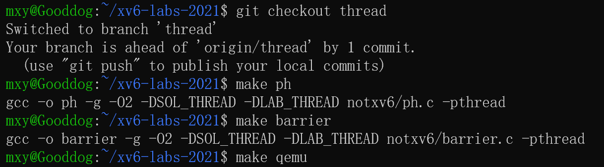

*图 3-6a：Lab 6 多线程运行测试之一*

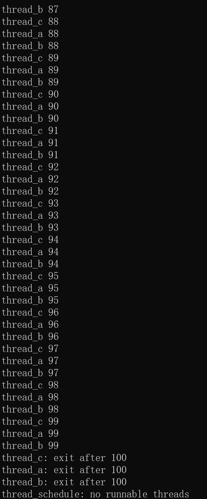

*图 3-6b：Lab 6 多线程运行测试之二*

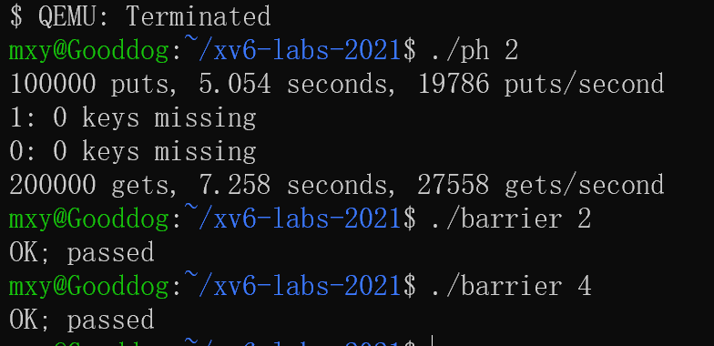

*图 3-6c：Lab 6 多线程修复演示，与 ph / barrier 相关*

图中 3-6a 是 xv6 内运行的 `uthread`：三个用户线程 thread_a/b/c 轮流执行并各自打印 0~99，最终都输出 exit after 100。三线程能交替运行到各自结束，说明用户态线程的创建、调度与上下文切换（保存/恢复寄存器）实现正确。图 3-6b、3-6c 是宿主机上的 ph 与 barrier 测试：`./ph 2` 在多线程并发向哈希表插入后输出 0 keys missing，说明 per-bucket 锁消除了丢键竞态；`./barrier 2`、`./barrier 4` 都输出 OK; passed，说明条件变量实现的屏障能让指定数量的线程反复对齐到同一轮次。

#### 实验中遇到的问题及解决

| 问题 | 解决 |
| --- | --- |
| 多线程 put 丢键根因 | 明确"读-改-写表头"竞态窗口；per-bucket 锁覆盖整段临界区 |
| context 寄存器不全导致新线程踩脏调用者状态 | 完整保存/恢复与内核一致的 14 个寄存器，不止 ra/sp |
| thread_create 忘设 sp | 新线程须用各自栈，`sp = stack + STACK_SIZE`，否则共享 main 栈互相践踏 |

#### 实验心得
线程切换说到底就是保存和恢复一组寄存器，和内核里进程切换的原理是一样的，只是换到了用户态自己来管。ph 的问题也很有意思：单线程没事、多线程丢键，是因为两个线程同时往同一个桶的表头插节点会互相覆盖，解法是每个桶一把锁，既保证安全又让不同桶之间还能并行，实测 2 线程吞吐约是单线程的 3.4 倍。条件变量的 `cond_wait` 会原子地放开锁再睡，这是它和普通忙等不一样的地方。把 book 第 6、7 章的锁和上下文切换例子与这些代码对照起来，很多疑问都能在文档里找到答案。

---

### Lab 7 · Networking

#### 实验目的
给 xv6 补上 e1000 网卡的驱动，理解内存映射寄存器、DMA 和环形描述符这种设备与 CPU 通信的模型，并把发送函数 `e1000_transmit()` 和接收函数 `e1000_recv()` 写出来。动手前，我根据官方 Lab: networking 的提示阅读了 e1000 手册中关于寄存器和描述符的说明，并复习了 xv6 book 第 5 章的中断处理。

#### 实验内容与步骤

**硬件模型**：内存中 TX/RX 环形描述符各有 16 个，描述符指向数据缓冲 mbuf；软件写描述符并推进 `TDT`，也就是 Tail 寄存器，网卡 DMA 取走/写入后回写 `DD` 状态位；收包完成后网卡中断，`e1000_intr()` 调 `e1000_recv()`。

**① e1000_transmit，发送一帧**
1. 取 `regs[E1000_TDT]` 指向的描述符；
2. 检查其 `DD` 位，未置说明上一包未发完，即 ring 满，返回 -1；
3. 释放该槽历史 mbuf，说明已发完；
4. 填描述符：`addr = m->head`、`length = m->len`、`cmd = EOP|RS`、清 status；
5. 把 mbuf 存入 `tx_mbufs[idx]`，等 DD 后再释放；推进 `TDT`；`__sync_synchronize()` 后释放锁。

**核心实现：`kernel/e1000.c` 的 `e1000_transmit()`**

```c
int
e1000_transmit(struct mbuf *m)
{
  acquire(&e1000_lock);

  int idx = regs[E1000_TDT];              // 下一个要用的描述符
  struct tx_desc *desc = &tx_ring[idx];

  // DD 位未置 → 该槽还在被网卡使用（上一个包没发完），ring 满
  if((desc->status & E1000_TXD_STAT_DD) == 0){
    release(&e1000_lock);
    return -1;
  }

  // 释放该槽上次使用的 mbuf（首次为 0，后续发完才轮到本槽）
  if(tx_mbufs[idx] != 0)
    mbuffree(tx_mbufs[idx]);

  // 装载新帧
  tx_mbufs[idx] = m;
  desc->addr = (uint64)m->head;            // 帧数据所在
  desc->length = m->len;                   // 帧长度
  desc->cmd = E1000_TXD_CMD_EOP | E1000_TXD_CMD_RS; // 整包+要状态回报
  desc->status = 0;                        // 清旧状态

  // 推进 Tail，网卡即开始 DMA 发送
  regs[E1000_TDT] = (idx + 1) % TX_RING_SIZE;
  __sync_synchronize();                    // 确保写已对设备可见
  release(&e1000_lock);
  return 0;
}
```

**② e1000_recv，接收一包**
1. 从 `RDT+1` 开始循环：描述符 `DD` 未置则无新包，结束；
2. `mbufput(m, desc->length)` 修正长度后交给 `net_rx()`，由协议栈负责释放；
3. 立即补新 `mbufalloc` 回填描述符并复位状态、推进 `RDT`，循环处理同一时刻堆积的多个包。

**核心实现：`kernel/e1000.c` 的 `e1000_recv()`**

```c
static void
e1000_recv(void)
{
  while(1){
    int idx = (regs[E1000_RDT] + 1) % RX_RING_SIZE;   // 下一个有数据的槽
    struct rx_desc *desc = &rx_ring[idx];

    if((desc->status & E1000_RXD_STAT_DD) == 0)
      break;                              // 无新包

    // 收到一个包：取 mbuf、修正其长度（网卡 DMA 了多少字节）
    struct mbuf *m = rx_mbufs[idx];
    mbufput(m, desc->length);

    // 交给网络协议栈处理（内部最终 mbuffree）
    net_rx(m);

    // 归还新缓冲给网卡，复位状态，推进 RDT
    rx_mbufs[idx] = mbufalloc(0);
    if(rx_mbufs[idx] == 0)
      panic("e1000");
    desc->addr = (uint64)rx_mbufs[idx]->head;
    desc->status = 0;
    regs[E1000_RDT] = idx;
  }
}
```

#### 测试结果

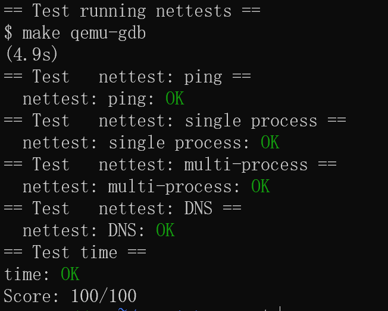

*图 3-7：Lab 7 net 评分结果（ping / single / multi / DNS 均通过）*

#### 实验中遇到的问题及解决

| 问题 | 解决 |
| --- | --- |
| transmit 的 mbuf 何时释放 | 不能 submit 后立即释放，因为 DMA 可能仍在读；存入槽位待该描述符 DD，即网卡用完后再释放 |
| recv 不补缓冲网卡停收 | 取一包补一包新 mbuf 并每步推 RDT |
| mbuf 长度 | 网卡把实际字节数写入 `rx_desc.length`，须 `mbufput` 后协议栈才能看到完整包 |
| 描述符/寄存器可见性 | 改完描述符先 `__sync_synchronize()` 再推 TDT，保证顺序 |

#### 实验心得
写驱动就像在跟“另一台会自己干活的处理器”打交道，这个处理器就是网卡：我们用内存映射的方式读写它的寄存器，把要发的包填进内存里的描述符环，它通过 DMA 自己取走；收包时它写状态位并发中断，我们再把包从环里取出来交给协议栈。最容易出错的是 mbuf 的生命周期：什么时候交给硬件、什么时候能释放，每一步都要想清楚，否则不是泄漏就是悬垂。另外，一次中断就把整个接收环排空，其实就是 NAPI 那种思路的简化版。

---

### Lab 8 · Locks

#### 实验目的
多核环境下，一把全局大锁会成为性能瓶颈，可以用 xv6 自带的 `statistics` 统计每把锁的 test-and-set 和 acquire 次数，直观看到竞争有多激烈。本实验要做两件事：① 把内存分配器改成每个 CPU 各有一条空闲链表；② 把块缓存 bcache 改成按哈希分成多个桶，目的都是消除全局锁竞争。动手前，我按官方 Lab: locks 的建议，先用 xv6 book 第 6 章复习了锁与临界区的知识，再对照 hints 用 statistics 统计各锁的竞争情况。

#### 实验内容与步骤

**① Memory allocator，即 kalloctest**
- `kmem[NCPU]`：每 CPU 一把锁 + 一条空闲链表；
- `kinit()`：先让 CPU0 持有全部空闲内存，初始化简单且无缝隙问题；
- `kalloc()`：关中断，即 `push_off`，读 `cpuid()` 取本 CPU 链表；空则轮询其他 CPU，从 CPU0 起**偷一页**；`kfree()` 把页归还当前 CPU 链表。

**② Buffer cache，即 bcachetest**
- 结构：`bucket[NBUCKET]`，共 13 桶，每桶 = 自旋锁 + LRU 哨兵头，块号按 `blockno % NBUCKET` 定桶；
- `binit()`：各桶空链表初始化；所有缓冲先挂桶 0，运行时由 bget 搬至各自哈希桶；
- `bget()` 分三阶段：① 本桶查命中，refcnt++；② 本桶有 `refcnt==0` 则回收，移到桶头；③ 本桶满则轮询其他桶"偷"空闲缓冲；
- `brelse()`/`bpin()`/`bunpin()`：均按哈希桶加锁后操作 refcnt。

**③ param.h 配套**：`LAB_LOCK` 下把 `FSSIZE` 调大，因为 README 提示 usertests 的 writebig 需要更大的文件系统。

#### 核心代码

**per-CPU 内存分配器：`kernel/kalloc.c`**

```c
// lab 8: 每个 CPU 一条独立空闲链表 + 独立锁，
// 消除多核争用同一把 kmem.lock 的竞争。
struct {
  struct spinlock lock;
  struct run *freelist;
} kmem[NCPU];

void *
kalloc(void)
{
  struct run *r;

  // 关中断读 cpuid：保证整段操作与"本 CPU"绑定
  push_off();
  int id = cpuid();

  acquire(&kmem[id].lock);
  r = kmem[id].freelist;
  if(r)
    kmem[id].freelist = r->next;
  release(&kmem[id].lock);

  // 本 CPU 链表空：轮询其他 CPU "偷"一页
  if(!r){
    for(int i = 0; i < NCPU; i++){
      int other = i;
      if(other == id)
        continue;
      acquire(&kmem[other].lock);
      if(kmem[other].freelist){
        r = kmem[other].freelist;
        kmem[other].freelist = r->next;
        release(&kmem[other].lock);
        break;
      }
      release(&kmem[other].lock);
    }
  }
  pop_off();

  if(r)
    memset((char*)r, 5, PGSIZE); // fill with junk
  return (void*)r;
}
```

**bcache 哈希分桶的桶结构：`kernel/bio.c`**

```c
  struct bucket {
    struct spinlock lock;
    struct buf head;      // 桶内 LRU 哨兵：head.next 最近用，head.prev 最久
  } bucket[NBUCKET];

// 块号 → 桶号（NBUCKET 取质数使分布更均匀）
static struct bucket *
hash_bucket(uint dev, uint blockno)
{
  return &bcache.bucket[blockno % NBUCKET];
}
```

**bcache 哈希分桶的 bget 三阶段：`kernel/bio.c`**

```c
static struct buf*
bget(uint dev, uint blockno)
{
  struct buf *b;
  struct bucket *bk = hash_bucket(dev, blockno);
  acquire(&bk->lock);

  // ① 本桶查缓存命中
  for(b = bk->head.next; b != &bk->head; b = b->next){
    if(b->dev == dev && b->blockno == blockno){
      b->refcnt++;
      release(&bk->lock);
      acquiresleep(&b->lock);
      return b;
    }
  }

  // ② 本桶有未使用缓冲则直接回收（不跨桶，减少锁竞争）
  for(b = bk->head.prev; b != &bk->head; b = b->prev){
    if(b->refcnt == 0){
      b->dev = dev;
      b->blockno = blockno;
      b->valid = 0;
      b->refcnt = 1;
      ... // 移到桶头（最近使用）
      release(&bk->lock);
      acquiresleep(&b->lock);
      return b;
    }
  }
  release(&bk->lock);

  // ③ 本桶满了：到其他桶偷一个空闲缓冲
  ...
  panic("bget: no buffers");
}
```

#### 测试结果

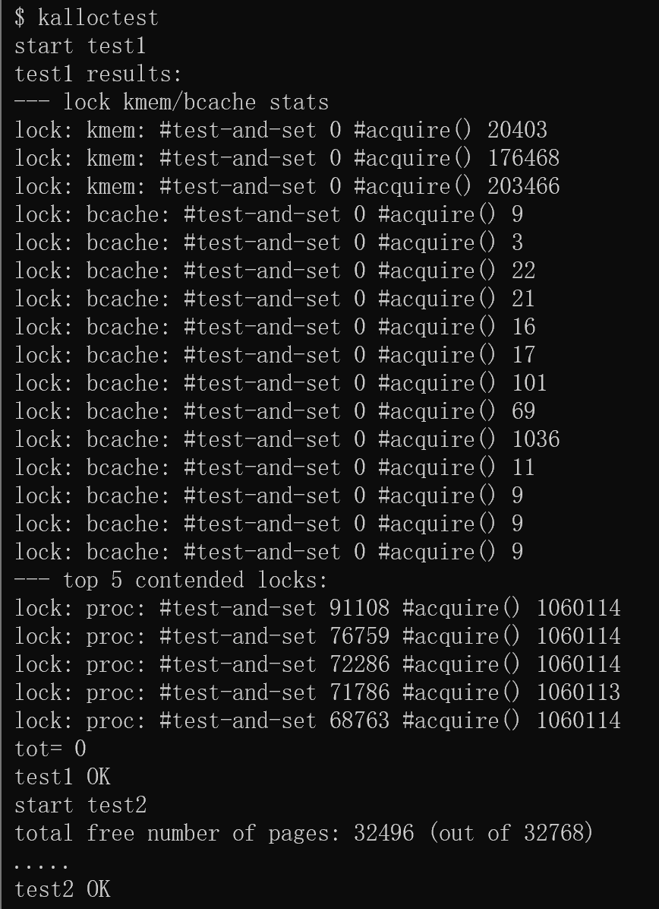

*图 3-8a：Lab 8 kalloctest——kmem/bcache 锁竞争归零*

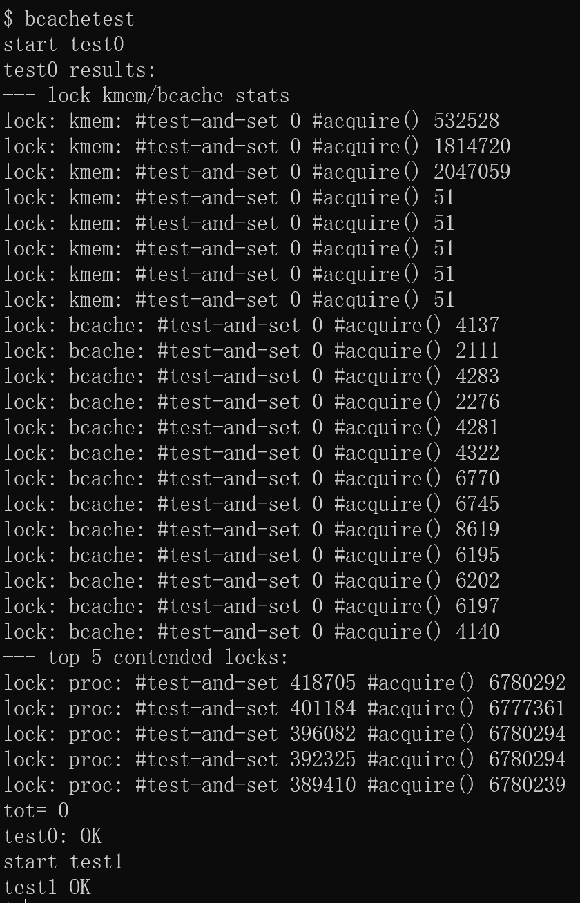

*图 3-8b：Lab 8 bcachetest——test0/test1 通过*

图中 `kalloctest` 让多个进程并发申请和释放内存，改造后各 CPU 锁的 test-and-set 次数都降到 0，说明 per-CPU 空闲链表把内存分配的共享面缩到了单核，全局锁竞争被消除；`bcachetest` 同样并发访问块缓存，test0 和 test1 都通过，bcache 相关锁的竞争次数也归零，说明按块号哈希分桶后，不同桶的块访问不再抢同一把锁。两个测试都体现了锁细化后竞争明显下降的优化效果。

#### 实验中遇到的问题及解决

| 问题 | 解决 |
| --- | --- |
| 启动随机 panic，源于均分内存方案 | 均分边界易错难查，改用"全部内存归 CPU0 + 按需偷页"的简单稳定方案 |
| binit 桶下标越界，源于用指针差算桶号 | 指针差超过 NBUCKET；改为初始化全部挂桶 0，运行时再搬移 |
| usertests writebig 报 `balloc: out of blocks`，首评 51/70 | `FSSIZE` 过小；`#ifdef LAB_LOCK` 下改为 10000 后 70/70 |

#### 实验心得
锁竞争激烈，归根结底是“临界区太大 + 共享的数据太多”。per-CPU 分配器把每核要用的内存分开管，bcache 按块号哈希到不同桶，思路都是缩小共享范围：要么只给自己那核的，要么只和同桶的争。代价是可能负载不均，某个 CPU 的链表空了就得去别的 CPU“偷”，正好让我理解了用空间换竞争这个取舍。配合 statistics 的数字，这次锁优化是看得见效果的。statistics 是官方 hints 特意提到的工具，先量化竞争再改代码，优化效果一目了然。

---

### Lab 9 · File system

#### 实验目的
改造文件系统支持两类新特性：① 支持大文件，给 inode 增加一层“双间接块”索引，把单个文件的上限从 268 块提高到 65803 块；② 支持符号链接，实现 `symlink(target, path)` 系统调用，并让 `open()` 打开符号链接时能自动跟到它指向的真实文件。动手前，我通读了官方 Lab: file system 的说明，并对照 xv6 book 第 8 章学习了 inode 与块分配的实现。

#### 实验内容与步骤

**① Large files**
- `fs.h`：`NDIRECT 12→11`，新增 `NDBL_INDIRECT = NINDIRECT*NINDIRECT`、`MAXFILE = NDIRECT+NINDIRECT+NDBL_INDIRECT`；`dinode` 与内存 `inode` 的 `addrs` 都扩为 `NDIRECT+2`，即加一个双间接槽；
- `fs.c` `bmap()` 增加双间接分支：`bn` 减去直接+单间接偏移后，先定位/分配双间接块，存在 `addrs[NDIRECT+1]`，其内用 `bn/NINDIRECT` 定位单间接块，再 `bn%NINDIRECT` 定位数据块；
- `fs.c` `itrunc()` 与分配**对称**的三层释放：读双间接块 → 对其每个单间接块先释放数据块再释放单间接块 → 最后释放双间接块。

**② Symbolic links**
- 五件套新增 `SYS_symlink 22`；`stat.h` 加 `T_SYMLINK 4`；`fcntl.h` 加 `O_NOFOLLOW 0x004`，与其他位不重叠；`fs.h` 加 `NSYMLINK 10`，作为跟随深度上限来防环；Makefile 注册 `symlinktest`；
- `sys_symlink()`：`create(path, T_SYMLINK,...)` 创建特殊文件，再用 `writei` 把 target 路径字符串写入文件内容，注意 `strlen` 不含 `\0`；
- `follow_symlink()`：递归——`readi` 读出目标路径，手动补 `\0` → 释放当前 inode → `namei` 目标 → 若仍是 `T_SYMLINK` 则继续跟，超过 `NSYMLINK` 深度视为成环返回失败；
- `sys_open()`：非 `O_NOFOLLOW` 且命中符号链接时调 `follow_symlink` 拿到真实文件；`O_NOFOLLOW` 则直接打开链接本身。

#### 核心代码

**大文件：bmap 的双间接块分支，见 `kernel/fs.c`**

```c
  bn -= NINDIRECT;

  // 双间接块——addrs[NDIRECT+1] 指向一个"目录块"，
  // 该目录块含 NINDIRECT 个指针，每个指向一个单间接块。
  if(bn < NDBL_INDIRECT){
    if((addr = ip->addrs[NDIRECT+1]) == 0)
      ip->addrs[NDIRECT+1] = addr = balloc(ip->dev);   // 分配双间接块
    bp = bread(ip->dev, addr);
    a = (uint*)bp->data;

    // 第一级：bn / NINDIRECT 定位到某个单间接块
    if((addr = a[bn / NINDIRECT]) == 0){
      a[bn / NINDIRECT] = addr = balloc(ip->dev);       // 分配单间接块
      log_write(bp);
    }
    brelse(bp);

    // 第二级：在单间接块中 bn % NINDIRECT 定位数据块
    bp2 = bread(ip->dev, addr);
    a2 = (uint*)bp2->data;
    if((addr = a2[bn % NINDIRECT]) == 0){
      a2[bn % NINDIRECT] = addr = balloc(ip->dev);
      log_write(bp2);
    }
    brelse(bp2);
    return addr;
  }
  panic("bmap: out of range");
```

**大文件：itrunc 对称释放双间接块，见 `kernel/fs.c`**

```c
  // lab 9: 释放双间接块——
  // ① 读取双间接块，对其指向的每个单间接块：先释放其数据块，再释放该单间接块
  // ② 最后释放双间接块本身
  if(ip->addrs[NDIRECT+1]){
    bp = bread(ip->dev, ip->addrs[NDIRECT+1]);
    a = (uint*)bp->data;
    for(j = 0; j < NINDIRECT; j++){
      if(a[j]){
        bp2 = bread(ip->dev, a[j]);      // 该单间接块
        a2 = (uint*)bp2->data;
        for(k = 0; k < NINDIRECT; k++){  // 释放其下所有数据块
          if(a2[k])
            bfree(ip->dev, a2[k]);
        }
        brelse(bp2);
        bfree(ip->dev, a[j]);            // 释放单间接块本身
      }
    }
    brelse(bp);
    bfree(ip->dev, ip->addrs[NDIRECT+1]); // 释放双间接块本身
    ip->addrs[NDIRECT+1] = 0;
  }
```

**符号链接：`sys_symlink` 与 `follow_symlink`，见 `kernel/sysfile.c`**

```c
// 创建符号链接 sys_symlink(target, path)
uint64
sys_symlink(void)
{
  char target[MAXPATH], path[MAXPATH];
  struct inode *ip;
  int n;

  if(argstr(0, target, MAXPATH) < 0 || argstr(1, path, MAXPATH) < 0)
    return -1;
  begin_op();

  // 创建 type=T_SYMLINK 的特殊文件；内容（target 路径）稍后写入
  if((ip = create(path, T_SYMLINK, 0, 0)) == 0){
    end_op();
    return -1;
  }

  // 把 target 字符串作为文件内容写入 inode
  n = strlen(target);
  if(writei(ip, 0, (uint64)target, 0, n) != n){
    iunlockput(ip);
    end_op();
    return -1;
  }
  iunlockput(ip);
  end_op();
  return 0;
}

// lab 9: 跟踪符号链接——ip 是已持锁的符号链接 inode，
// 返回其最终指向的真实文件 inode（保持持锁），超过最大深度返回 0。
static struct inode*
follow_symlink(struct inode *ip, int depth)
{
  char target[MAXPATH];
  struct inode *nip;
  int n;

  if(depth > NSYMLINK)      // 超过深度：近似判定成环
    return 0;

  n = readi(ip, 0, (uint64)target, 0, MAXPATH);
  if(n <= 0)
    return 0;
  target[n] = '\0';          // writei 只写了 strlen 字节（无 '\0'），手动补

  iunlockput(ip);
  if((nip = namei(target)) == 0)
    return 0;
  ilock(nip);
  if(nip->type == T_SYMLINK)
    return follow_symlink(nip, depth + 1);
  return nip;               // 指向真实文件（已持锁）
}
```

**sys_open 自动跟随符号链接，见 `kernel/sysfile.c`**

```c
    // 若打开的是符号链接且未指定 O_NOFOLLOW → 跟随到真实文件
    if(ip->type == T_SYMLINK && !(omode & O_NOFOLLOW)){
      if((ip = follow_symlink(ip, 0)) == 0){   // 跟随失败/成环
        end_op();
        return -1;
      }
    }
```

#### 测试结果

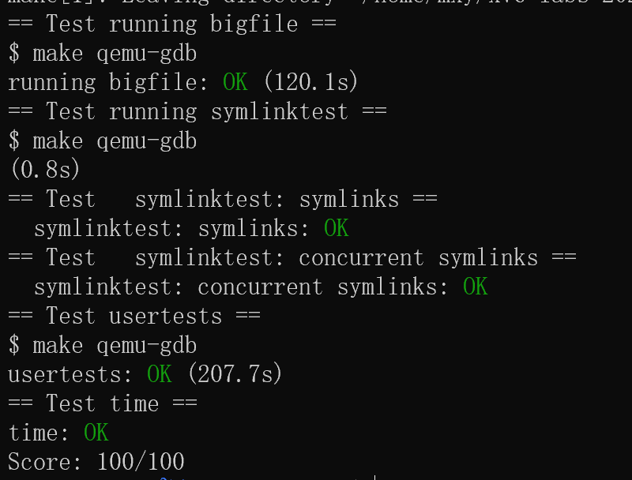

*图 3-9：Lab 9 fs 评分结果（bigfile / symlinktest 均通过）*

#### 实验中遇到的问题及解决

| 问题 | 解决 |
| --- | --- |
| `writei` 不写字符串终止符 | `follow_symlink` 的 `readi` 需按返回值 `target[n]='\0'`，否则 `namei` 读到越界垃圾 |
| 只改 bmap 不改 itrunc 会泄漏整棵双间接块 | 分配与释放必须镜像对称，用三层循环 |
| 链接成环无限递归 | `NSYMLINK` 深度上限近似判环并返回错误 |
| 锁/释放纪律 | follow 成功返回的 inode 须持锁，与 namei 路径一致；失败路径由 follow 内部释放，调用方不重复 `iunlockput` |

#### 实验心得
文件能存多大，其实就取决于索引有几层：多一层间接块，容量差不多按 NINDIRECT 倍增长，代价是 `bmap` 分配和 `itrunc` 释放都要多写一层循环，而且两者必须对称，否则会泄漏整棵间接块。符号链接的实现让我明白，它本质上就是内容是一段路径的特殊文件，和硬链接完全不同，硬链接是同一个 inode 挂多个目录项；内核是在路径解析，也就是 `open`/`namei` 时去跟随它的。文件系统代码对锁和日志事务的要求特别严格，begin_op/end_op 的顺序错了就出问题。配合 book 第 8 章的图和代码理解 inode 布局后，再改 bmap 和 itrunc 会容易很多。

---

### Lab 10 · mmap

#### 实验目的
实现 `mmap`/`munmap`，把文件内容映射进进程的地址空间，之后读写文件就像读写普通内存一样。实现要点包括：用 VMA 记录每段映射；懒加载，第一次访问某页才真正读盘；把 MAP_SHARED 下被改过的脏页写回文件；以及处理好 `fork`/`exit` 时的联动。动手前，我按官方 Lab: mmap 的提示，结合 xv6 book 第 3、8 章复习了页表映射与文件读写，为理解 VMA 的思路做准备。

#### 实验内容与步骤

**① 数据结构与常量**
- `proc.h`：`struct vm_area {used, addr, len, prot, flags, offset, f}` + 进程内 `vmas[16]`，进程私有无需锁；
- `riscv.h`：`PTE_D (1L<<7)`，是脏位；`memlayout.h`：`MMAPMINADDR`；五件套新增 `SYS_mmap 22`/`SYS_munmap 23`。

**② sys_mmap，懒分配**
- 参数校验：flags 须为 MAP_SHARED/MAP_PRIVATE；`MAP_SHARED + PROT_WRITE` 要求文件可写；
- 找空闲 VMA 槽；确定起始地址，addr=0 时内核从 `MMAPMINADDR` 起向下分配；记录元数据并 `filedup(f)`，保证 close(fd) 后映射仍有效；**不分配物理页**。

**③ 缺页懒加载**
- `usertrap()`：`scause` 为 12/13/15，也就是取指/读/写页错误时，用 `r_stval()` 取故障地址调 `mmap_pagefault()`；
- `mmap_pagefault()`：在 VMA 表定位 → `kalloc` 页 → 计算文件偏移 `(va-addr)+offset` → `readi` 读入，超出文件部分清零 → 按 prot 组 PTE 权限 → `mappages`。

**④ sys_munmap，脏页写回 + 解除**
- 逐页检查：`MAP_SHARED` 且 `PTE_D` 脏页 → 用 `writei` 写回文件，**必须包在 begin_op/end_op 日志事务内**；
- 用自建的宽容版 `uvm_cleanunmap()` 解除映射，因为懒加载未触发过的页没有 PTE，原版 uvmunmap 会 panic；
- 按"整体 / 去头部 / 去尾部"更新 VMA，整区解除则释放槽位并 `fileclose`。

**⑤ fork / exit 联动**
- `fork()`：复制 VMA 数组并对每个映射文件 `filedup`，懒加载页各进程缺页时自行分配，天然隔离；
- `exit()`：先调 `unmap_all_vmas()`，逐 VMA 写回脏共享页、解除映射、fileclose，再关闭其他文件。

#### 核心代码

**sys_mmap：记录 VMA、懒分配，见 `kernel/sysfile.c`**

```c
uint64
sys_mmap(void)
{
  uint64 addr, offset;
  int len, prot, flags, fd;
  struct file *f;
  struct proc *p = myproc();

  argaddr(0, &addr);
  argint(1, &len);
  argint(2, &prot);
  argint(3, &flags);
  argint(4, &fd);
  argaddr(5, &offset);

  if(len < 0 || (flags != MAP_SHARED && flags != MAP_PRIVATE))
    return -1;
  if((f = getfile(fd)) == 0)
    return -1;
  // 可写+共享 映射要求文件可写（否则数据无法写回）
  if(flags == MAP_SHARED && (prot & PROT_WRITE) && !f->writable)
    return -1;

  int idx = -1;                       // 找空闲 VMA 槽
  for(int i = 0; i < 16; i++)
    if(!p->vmas[i].used){ idx = i; break; }
  if(idx < 0)
    return -1;

  // 分配起始地址：addr=0 时从 MMAPMINADDR 往下找；否则按 addr 页对齐
  uint64 base;
  ...
  // 记录 VMA（懒分配，物理页留给缺页时）
  p->vmas[idx].used = 1;
  p->vmas[idx].addr = base;
  p->vmas[idx].len = len;
  p->vmas[idx].prot = prot;
  p->vmas[idx].flags = flags;
  p->vmas[idx].offset = offset;
  p->vmas[idx].f = f;
  filedup(f);          // mmap 期间文件即使 close 也有效
  return base;
}
```

**缺页懒加载函数 mmap_pagefault，见 `kernel/sysfile.c`**

```c
int
mmap_pagefault(uint64 va)
{
  struct proc *p = myproc();
  int idx;
  struct vm_area *v;
  char *mem;
  uint64 off;
  uint flags;

  if(find_vma(p, va, &idx) < 0)
    return -1;
  v = &p->vmas[idx];
  if((mem = kalloc()) == 0)
    return -1;

  // 读取文件内容到该页：文件内偏移 = (va-addr)+v->offset
  off = (va - v->addr) + v->offset;
  memset(mem, 0, PGSIZE);            // 超文件部分清零

  ilock(v->f->ip);
  if(off < v->f->ip->size){
    int n = PGSIZE;
    if(off + n > v->f->ip->size)
      n = v->f->ip->size - off;
    readi(v->f->ip, 0, (uint64)mem, off, n);
  }
  iunlock(v->f->ip);

  // 权限：用户位 + 读位 +（可写时）写位。PTE_X 仅当要求可执行。
  flags = PTE_U | PTE_R;
  if(v->prot & PROT_WRITE)
    flags |= PTE_W;
  if(v->prot & PROT_EXEC)
    flags |= PTE_X;

  // 建映射（懒分配的物理页也记录到页表；写权限按 prot 给）
  if(mappages(p->pagetable, PGROUNDDOWN(va), PGSIZE, (uint64)mem, flags) < 0){
    kfree(mem);
    return -1;
  }
  return 0;
}
```

**sys_munmap：脏页写回 + 解除映射，见 `kernel/sysfile.c`**

```c
  // 逐页处理：先写回共享脏页（在日志事务内），再解除映射
  int dirty_written = 0;
  for(uint64 a = addr; a < addr + len; a += PGSIZE){
    pte_t *pte = walk(p->pagetable, a, 0);
    if(pte && (*pte & PTE_V)){
      uint64 pa = PTE2PA(*pte);
      // MAP_SHARED 且脏页 → 写回文件
      if(v->flags == MAP_SHARED && (*pte & PTE_D)){
        if(!dirty_written){
          begin_op();               // 写盘须在日志事务内
          dirty_written = 1;
        }
        uint64 off = (a - v->addr) + v->offset;
        int n = PGSIZE;
        if(off + n > v->f->ip->size)
          n = v->f->ip->size - off;
        if(n > 0){
          ilock(v->f->ip);
          writei(v->f->ip, 0, pa, off, n);
          iunlock(v->f->ip);
        }
      }
    }
  }
  if(dirty_written)
    end_op();

  // 解除映射并释放物理页（懒加载未触发的页会被宽容跳过）
  uvm_cleanunmap(p->pagetable, addr, len / PGSIZE, 1);

  // 处理 VMA：若整个区域都被解除，释放槽位
  if(addr == v->addr && len == v->len){
    v->used = 0;
    fileclose(v->f);
  } else if(addr == v->addr){
    v->addr += len;
    v->len -= len;
    v->offset += len;
  } else if(addr + len == v->addr + v->len){
    v->len -= len;             // 去掉尾部
  }
```

**fork 复制 VMA 与 uvm_cleanunmap，见 `kernel/proc.c` 和 `kernel/vm.c`**

```c
  // lab 10: fork 复制 VMA 表（mmap 页是懒加载，元数据复制即可；
  // 每个映射文件增引用，保证子进程缺页时文件仍存在）
  for(i = 0; i < 16; i++){
    np->vmas[i] = p->vmas[i];
    if(np->vmas[i].used)
      filedup(np->vmas[i].f);
  }
```

```c
// lab 10: 与 uvmunmap 相同，但对"懒分配未建立映射"的页宽容处理
// （mmap 区域可能只有部分页被触发过）。已映射页释放，未映射页跳过。
void
uvm_cleanunmap(pagetable_t pagetable, uint64 va, uint64 npages, int do_free)
{
  uint64 a;
  pte_t *pte;

  if((va % PGSIZE) != 0)
    panic("uvm_cleanunmap: not aligned");

  for(a = va; a < va + npages*PGSIZE; a += PGSIZE){
    if((pte = walk(pagetable, a, 0)) == 0)
      continue;                  // 中间页表不存在 → 页未映射，跳过
    if((*pte & PTE_V) == 0)
      continue;                  // PTE 无效 → 页未映射，跳过
    if(PTE_FLAGS(*pte) == PTE_V)
      panic("uvm_cleanunmap: not a leaf");
    if(do_free){
      uint64 pa = PTE2PA(*pte);
      kfree((void*)pa);
    }
    *pte = 0;
  }
}
```

#### 测试结果

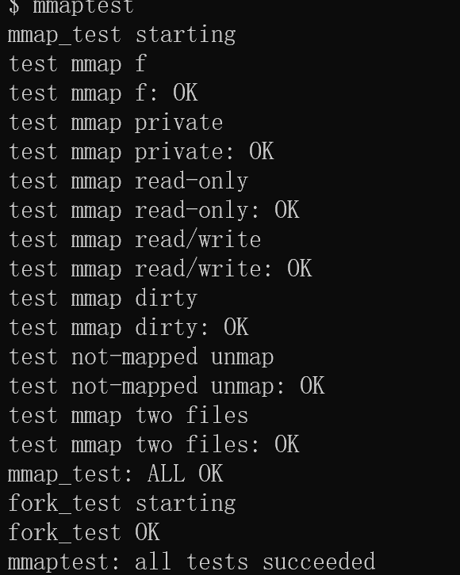

*图 3-10：Lab 10 mmaptest 运行结果，mmap_test 各子测试与 fork_test 均通过*

图中 `mmaptest` 的各子用例全部通过：它先对一个文件做 mmap 并逐页读写，验证懒加载下访问到的页会被正确读入、数据与文件一致；随后验证 munmap 后 MAP_SHARED 中被改写的脏页会写回文件，重新打开文件能看到写入内容；还测试了 MAP_PRIVATE 下修改不影响原文件、按页读写边界与多段映射的拆分解除。最后的 `fork_test` 验证父进程 mmap 后 fork 出的子进程能继续访问同一段映射，退出或 unmap 时各自的脏页都能正确写回，说明 fork/exit 对 VMA 的复制与清理实现完整。

#### 实验中遇到的问题及解决

| 问题 | 解决 |
| --- | --- |
| 写回文件 panic `log_write outside of trans` | xv6 文件写必须在日志事务内，写回循环包 `begin_op()/end_op()`，有脏页才开事务 |
| 懒加载未触发页被 unmap 时 panic `not mapped` | 自定义 `uvm_cleanunmap`：遇不存在/无效 PTE 直接跳过 |
| mmap 起始地址选择 | addr=0 由内核从 MMAPMINADDR 向下分配，避免与堆/栈及 TRAPFRAME 冲突 |
| `exec mmaptest failed` | Makefile 未注册 `_mmaptest`，按 `LAB=mmap` 补注册 |

#### 实验心得
mmap 相当于把文件系统接进了虚拟内存：用户像读写数组一样读写文件。懒加载的部分其实是 Lab 5 COW 思路的复用，平时不分配物理页，等到真正访问触发缺页了再临时从文件里读进来；而脏页写回则靠页表里的 D 位判断这页改没改过，只有改过的共享页才需要写回文件。映射不随 `close(fd)` 失效，靠 filedup 维持，还要跨 `fork`/`exit` 正确维护，等于把页表、陷阱、文件系统、进程这几个实验的知识点串在了一起，是很好的综合收尾。把 book 中页表和文件系统的知识串起来，再参考官方对 VMA 的提示，这个 Lab 的整体框架就很清晰了。

---

## 四、实验总结与心得

1. **对操作系统的整体认识**：从 Lab 1 写用户程序，到 Lab 10 做 mmap，一步一步把进程、虚拟内存、陷阱、文件、设备这几块补全了，也理解了它们是怎样配合起来让一个用户程序正常跑起来的。
2. **几个反复出现的套路**：
   - **拖到需要时再做**：COW、lazy allocation、mmap 懒加载，都是先把花钱的操作放着，等真的缺页了再补做；
   - **把共享的东西拆小**：per-CPU 分配器、bcache 哈希分桶、per-bucket 锁，都是缩小共享范围来减少锁竞争；
   - **加功能要连带着改很多地方**：内核里加一个字段或功能，分配、释放、fork 复制、exit 清理常常要一起改，漏一处就会内存泄漏或直接 panic。
3. **调试方法**：用 printf 打印关键点、gdb 断点/回溯、`kernel.asm` 配合 `addr2line` 把地址还原成函数名、qemu monitor 的 `info mem` 查页表。遇到 panic、死锁、页错误时，基本都能顺着这些工具定位到问题。
4. **工程习惯**：每个 Lab 用独立 git 分支管理；统一行尾；每次只改一小块并及时验证。10 个 Lab 能顺下来、代码又能随时回滚，靠的就是这些习惯。
5. **学习方式上的体会**：官方建议的"先读文档再动手、小步测试、别赶工"确实有用，先把手册和现成源码看懂再写，比一头扎进去试错效率高很多。

---


> 说明：代码仓库为 GitHub `crimelody/24OS-xv6`，各 Lab 对应独立分支。
